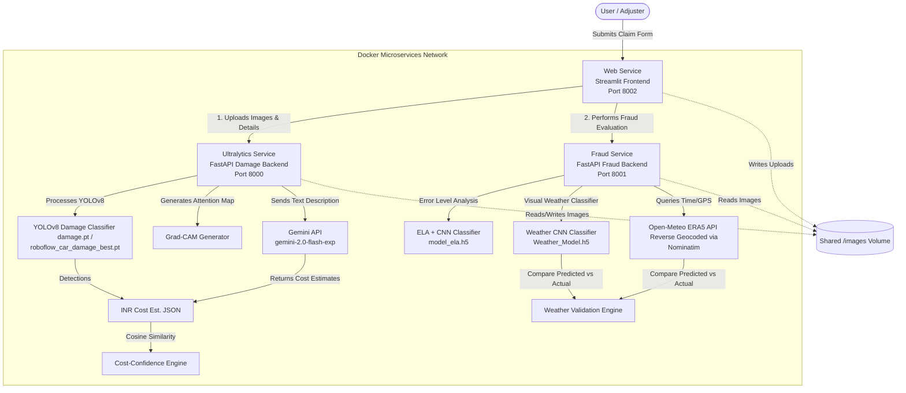

# Car Accident Report & Insurance Claim Verification System

A microservices-based system designed to automate car accident damage assessment, estimate repair costs, and detect potential insurance fraud. It leverages Deep Learning (YOLOv8, custom CNNs), Large Language Models (Google Gemini), and historical weather validation to provide insurance adjusters with a complete claim evaluation dashboard.

---

## System Architecture

The application is structured into three dockerized microservices communicating via REST APIs:



---

## Key Features

### 1. Streamlit Frontend UI (`Web/`)
- Interactive portal to submit accident details: License plate, owner details, make, model, year, GPS coordinates, and written descriptions.
- Support for uploading multiple accident photos.
- Displays comprehensive reports: annotated damage images, Grad-CAM model attention maps, Gemini-estimated repair costs in INR, and fraud risk badges.

### 2. AI Damage Detection & Valuation (`ultralytics/`)
- **YOLOv8 Damage Classification**: Scans images for 17 classes of vehicle damage (including `Bodypanel-Dent`, `bonnet-dent`, `fender-dent`, `Headlight-Damage`, `Windscreen-Damage`, etc.) using YOLO models trained on car damage datasets (`damage.pt` and `roboflow_car_damage_best.pt`).
- **Grad-CAM Visualizations**: Generates Grad-CAM (Gradient-weighted Class Activation Mapping) heatmaps for the YOLO model, displaying which areas of the image the neural network focused on when detecting damage.
- **LLM-Based Claim Assessment**: Sends the written accident description to the **Google Gemini API** (`gemini-2.0-flash-exp`) to parse claims and estimate repair costs in INR.
- **Cross-Verification**: Computes the **Cosine Similarity** between the damage types described (processed by Gemini) and visual damage detected (YOLO) to output a similarity confidence score.

### 3. Multi-Level Fraud Detection (`fraud/`)
- **Image Tampering Detection (ELA)**: Computes Error Level Analysis by saving the image at a specific quality level (90%), subtracting the resaved image from the original to highlight differences in compression levels, and passing the ELA map through a CNN model (`model_ela.h5`) to predict if the image was edited/tampered.
- **Weather Mismatch Validation**: 
  - A Weather CNN model (`Weather_Model.h5`) classifies the image environment into `Lightning`, `Rainy`, `Snow`, or `Sunny`.
  - The backend reverse-geocodes the coordinates (via Geopy/Nominatim) and queries the **Open-Meteo ERA5 Archive API** for the exact timestamp.
  - The actual weather is compared against the visual weather predicted by the CNN. A mismatch triggers a **HIGH FRAUD RISK** flag.

---

## Project Directory Structure

```text
Insurance-claim-checker/
├── docker-compose.yml           # Configures Web, Fraud, and Ultralytics services
├── images/                      # Shared Docker volume containing uploaded images
├── Web/                         # Streamlit Frontend Service
│   ├── main.py                  # Frontend app code and service calls
│   ├── car.py                   # Image process/damage API interface utilities
│   ├── database.py              # SQLite storage logic for storing claim history
│   ├── Dockerfile               # Alpine Python 3.12 image
│   └── requirements.txt         # Streamlit library
├── fraud/                       # Fraud Detection Service
│   ├── main.py                  # Core logic (ELA processing, Open-Meteo & Nominatim)
│   ├── fraud_detector.py        # FastAPI endpoints for single & batch detection
│   ├── create_dummy_models.py   # Script to generate fallback CNN models for testing
│   ├── models/                  # ELA and Weather .h5 model files (auto-generated if missing)
│   ├── Dockerfile               # TensorFlow 2.15.0 base image
│   └── requirements.txt         # TF, OpenCV, Geopy, FastAPI, Keras
└── ultralytics/                 # Damage Detection & LLM Service
    ├── damage.py                # FastAPI endpoints for YOLO and Gemini assessments
    ├── gen_cc2.py               # Runs YOLO predictions, Grad-CAM hooks, & Gemini calls
    ├── roboflow_car_damage_best.pt # YOLO weights for component-specific damage
    ├── damage.pt                # YOLO weights for general damage detection
    ├── grade_cam/               # Saved Grad-CAM attention heatmap images
    ├── description/             # Active claim descriptions stored as JSON
    ├── Dockerfile               # Ultralytics official base image
    └── requirements.txt         # FastAPI, Google Generative AI dependencies
```

---

## Setup & Execution

### Prerequisites
- [Docker](https://docs.docker.com/get-docker/) installed on your machine.
- [Docker Compose](https://docs.docker.com/compose/install/) installed.
- A Google Gemini API key (the system uses a development key by default in `ultralytics/gen_cc2.py`).

### Steps to Run
1. Clone this repository and navigate to its root directory.
2. Build and launch all services with Docker Compose:
   ```bash
   docker-compose up --build
   ```
3. Once running, access the services:
   - **Streamlit Web Application**: [http://localhost:8002](http://localhost:8002)
   - **Ultralytics Backend API**: [http://localhost:8000](http://localhost:8000)
   - **Fraud Detection Backend API**: [http://localhost:8001](http://localhost:8001)

4. *(Optional)* During startup, if TensorFlow model files are missing, the Fraud container will automatically trigger `create_dummy_models.py` to generate fallback CNN structures (`model_ela.h5` and `Weather_Model.h5`) under `fraud/models/` to ensure the API starts up immediately.

---

## API Documentation

### Damage Assessment API (Port `8000`)

#### `POST /damage`
Accepts an uploaded image file and returns object detection classes, confidence, and paths.
* **Request**: Multipart file upload (`img`).
* **Response JSON**:
  ```json
  {
    "results": "[... YOLOv8 raw prediction text ...]",
    "annotated_image_path": "/app/images/filename.jpg",
    "original_image_path": "/app/images/filename.jpg"
  }
  ```

#### `GET /damage`
Retrieves the saved annotated image or Grad-CAM heatmaps.
* **Parameters**: `img_path` (string) — Absolute path to image inside the container.
* **Response**: File response containing the requested PNG/JPG image.

#### `POST /description`
Saves claim metadata and description to a temporary file.
* **Request JSON**: Key-value pair payload containing user inputs.

#### `GET /gen`
Runs YOLO component evaluation, generates Grad-CAM overlays, coordinates Gemini description assessments, compares outputs using Cosine Similarity, and returns the result.
* **Response JSON**:
  ```json
  {
    "returncode": 0,
    "stdout": "...",
    "stderr": "...",
    "cost_conf_json": "{\n  \"confidence\": 0.85,\n  \"cost\": 15000\n}",
    "description_json_path": "/app/description/description.json"
  }
  ```

---

### Fraud Detection API (Port `8001`)

#### `POST /detect`
Uploads an image along with metadata to run ELA and weather verification.
* **Request Form-Data**: `image` (file), `timestamp` (string), `latitude` (float), `longitude` (float).
* **Response JSON**: ELA prediction, weather prediction mismatch result, fraud risk, and recommendations.

#### `POST /detect-path`
Runs fraud verification on an image file that already exists in the shared `/app/images/` volume.
* **Request JSON**:
  ```json
  {
    "image_path": "/app/images/car_accident.jpg",
    "timestamp": "2026-06-24 10:45:00",
    "latitude": 28.6139,
    "longitude": 77.2090
  }
  ```
* **Response JSON**:
  ```json
  {
    "success": true,
    "tamper_detection": {
      "class": "Real",
      "confidence": 98,
      "is_tampered": false
    },
    "weather_analysis": {
      "predicted_weather": "Sunny",
      "predicted_confidence": 95,
      "actual_weather": "Sunny",
      "location": "New Delhi, Delhi, India",
      "mismatch": false,
      "mismatch_reason": null
    },
    "fraud_risk": "LOW",
    "fraud_indicators": [],
    "recommendation": "✅ No fraud indicators detected. Claim appears legitimate."
  }
  ```

#### `GET /health`
Returns the status of the models and directories.
* **Response JSON**:
  ```json
  {
    "status": "ok",
    "available_models": ["model_ela.h5", "Weather_Model.h5"],
    "required_models": ["model_ela.h5", "Weather_Model.h5"],
    "images_dir_exists": true,
    "total_images": 1,
    "service": "fraud_detection"
  }
  ```
